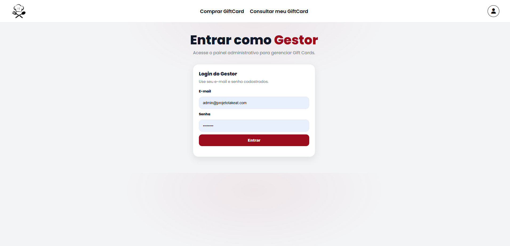
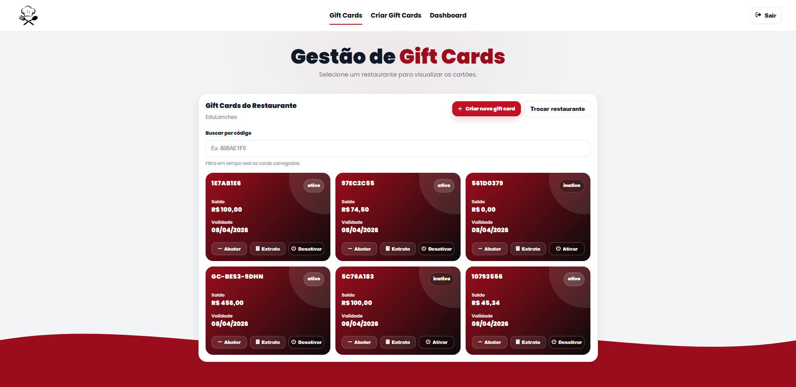
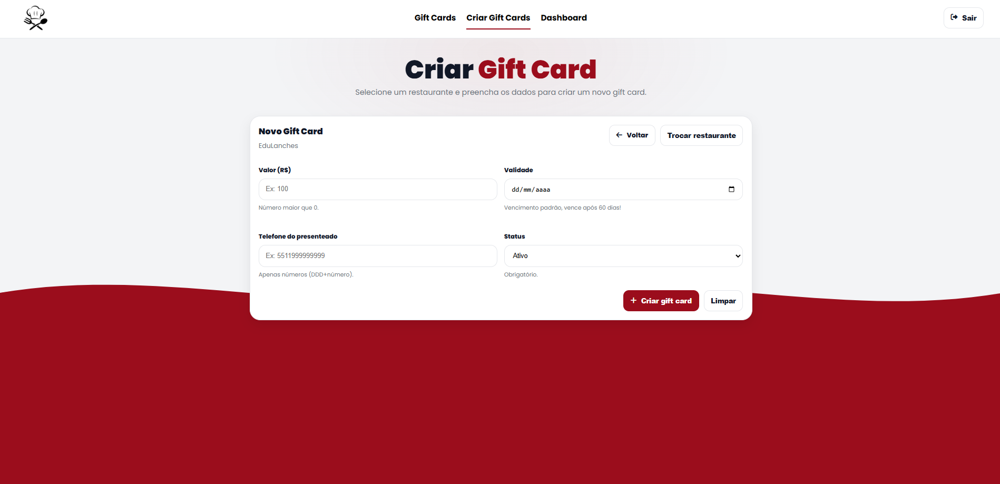
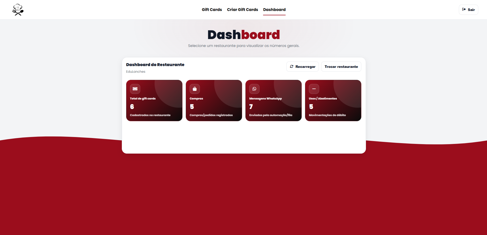
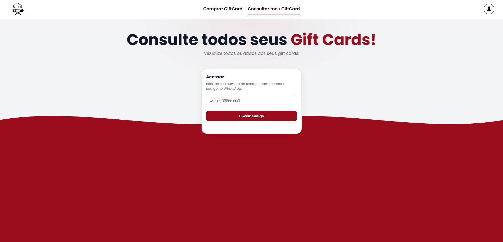
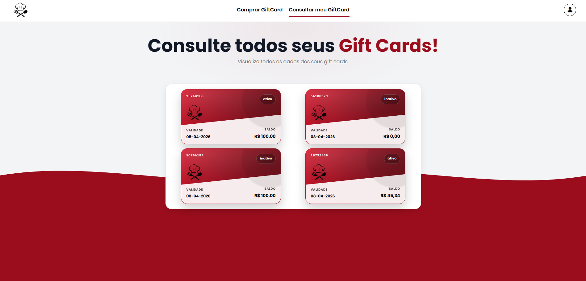
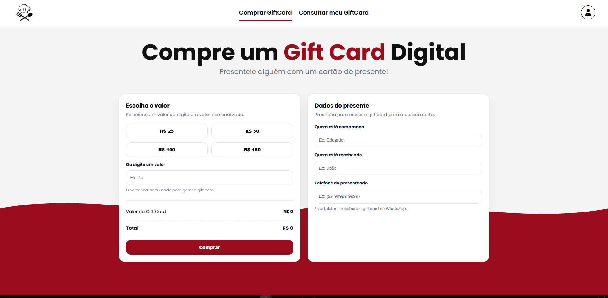
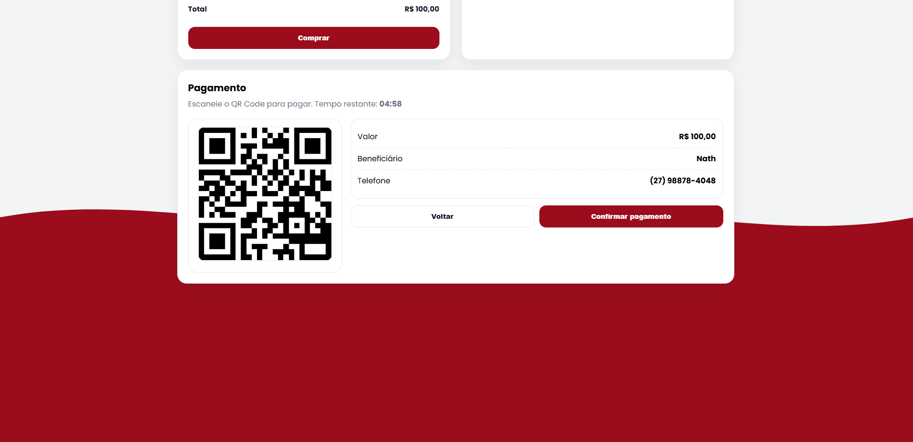

# MVP — Sistema de Gift Cards Digitais (Takeat)

Este projeto foi desenvolvido como um **MVP de Gift Cards Digitais**, com foco em validação rápida para restaurantes, seguindo o desafio técnico proposto pela Takeat.

O sistema permite:

- Restaurantes criarem e gerenciarem gift cards  
- Clientes comprarem gift cards digitais  
- Clientes consultarem gift cards com autenticação via WhatsApp (OTP)  
- Automação de mensagens via fila de eventos (simulação de WhatsApp)  

---

# 🚀 Como rodar o projeto

## Pré-requisitos

- Node.js 18+
- Conta no Supabase (PostgreSQL)
- Git instalado (opcional)

---

## 1. Instalar dependências

Dentro da pasta do projeto, execute:

```bash
npm install
```

## 2. Configurar variáveis de ambiente

Crie um arquivo chamado **`.env`** na raiz do projeto e adicione:

```env
PORT=3001

SUPABASE_URL=SEU_URL_SUPABASE
SUPABASE_ANON_KEY=SUA_ANON_KEY

NODE_ENV=development
SHOW_OTP=true
```
---

## 3. Rodar o projeto

Após configurar o `.env`, inicie o servidor com:

```bash
npm run dev
```

Servidor disponível em:

-API: http://localhost:3001

-Gestor: http://localhost:3001/gestor

-Cliente Compra: http://localhost:3001/cliente/compra

-Cliente Consulta: http://localhost:3001/cliente/consulta.html

---

## ✅ Requisitos do desafio (Checklist respondido)

---

### 1. Interface Gestor

O gestor consegue criar, ativar/desativar e abater saldo de gift cards.

<p align="center">
  
  
</p>

<p align="center">
  
  
</p>

---

### 2. Interface Cliente — Consulta

O cliente consulta seus gift cards com autenticação via OTP no WhatsApp.

<p align="center">
  
  
</p>

---

### 3. Interface Cliente — Compra

O cliente pode comprar um gift card digital e enviar para outra pessoa.

<p align="center">
  
  
</p>

---
# 🤖 Uso de IA / Vibe Code

Durante o desenvolvimento deste MVP, utilizei IA como suporte para acelerar entregas, gerar estrutura inicial de telas e auxiliar na identificação de bugs e inconsistências técnicas.

A IA foi usada principalmente em:

- Criação rápida de UI/UX (front-end em HTML/CSS/JS)
- Estruturação inicial de rotas e endpoints
- Debugging e correção de inconsistências com Supabase
- Ajustes finais para cumprir os requisitos do desafio dentro do prazo

---

## Prompt técnico 1 — Dashboard do Gestor

### Prompt utilizado

> “Crie uma tela de dashboard no estilo Takeat, onde o gestor seleciona um restaurante e visualiza métricas como total de gift cards, compras, mensagens WhatsApp e abatimentos.”

### Onde a IA ajudou

- Gerou rapidamente a base do layout e estrutura dos cards
- Facilitou o consumo inicial da API via `fetch`

### Onde atrapalhou

- A primeira versão não estava 100% consistente com o padrão visual já existente no projeto

### Ajustes manuais realizados

- Padronização do CSS para manter identidade Takeat
- Reaproveitamento de navbar/hero já existentes
- Integração correta com os endpoints reais do backend

---

## Prompt técnico 2 — Correção de Transações e Extrato

### Prompt utilizado

> “Meu extrato não está aparecendo e o banco só está salvando abatimento. Valide o schema do Supabase e corrija repository/service para registrar emissão e abatimento corretamente.”

### Onde a IA ajudou

- Identificou inconsistência entre tabela usada no código e tabela real do Supabase
- Direcionou a correção para `transacoes_cartao_presente`

### Onde atrapalhou

- Algumas sugestões iniciais eram genéricas e precisaram ser adaptadas ao schema real

### Ajustes manuais realizados

- Correção definitiva do repository para salvar emissão e abatimento
- Garantia de extrato completo ordenado por data
- Integração final entre service → repository → front-end

---

## Conclusão

A IA foi essencial para acelerar o desenvolvimento do MVP, porém todas as decisões finais, integrações críticas e ajustes de consistência foram realizados manualmente para garantir funcionamento e aderência total aos requisitos do desafio.

---

## 4. Automações / WhatsApp

O desafio exige ao menos uma automação baseada em eventos.

Neste MVP, foi implementado um fluxo de automação utilizando:

- **Fila de mensagens** (`fila_mensagens`)
- **Worker** que processa mensagens pendentes

Eventos automatizados:

- Envio de OTP no login do cliente
- Confirmação de compra de gift card
- Notificação ao presenteado via WhatsApp (simulado)

O worker marca mensagens como:

- `pendente`
- `enviado`
- `erro`

---

## 🗃️ Banco de Dados (Supabase)

Principais tabelas utilizadas:

- `cartoes_presente` → gift cards criados
- `compras` → compras realizadas (pendente/pago)
- `transacoes_cartao_presente` → emissão e abatimento (extrato)
- `fila_mensagens` → automação WhatsApp
- `otp_codes` / `sessoes_cliente` → autenticação OTP

---

## 🧱 Arquitetura Técnica

O backend foi estruturado em camadas para facilitar evolução:

- `controllers/` → rotas HTTP
- `services/` → regras de negócio
- `repositories/` → integração com Supabase
- `workers/` → automações e fila de eventos

O front-end foi construído em HTML/CSS/JS puro dentro de `public/`.

---

## 👨‍💻 Autor

Eduardo Klitzke Oliveira  
MVP desenvolvido para o Desafio Técnico Takeat — Gift Cards Digitais

---


